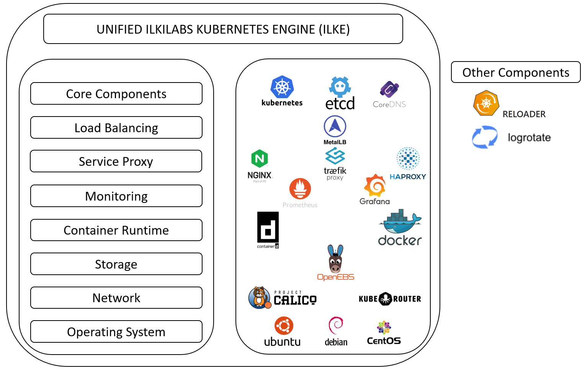

# ILKILABS KUBERNETES ENGINE
<!-- ALL-CONTRIBUTORS-BADGE:START - Do not remove or modify this section -->

<!-- ALL-CONTRIBUTORS-BADGE:END -->

This project is aimed to provide the simplest way to install kubernetes on AMD-64 bare-metal, virtual & Cloud environments.
Currently, Ubuntu 18.04 & 20.04,  Centos 7 and Debian 10  are supported, but several other operating systems will be available soon.

Master branch is stable.

## Table of Contents

This is a list of points that will be explained in this Readme file for the IKE project :

- [What is ILKE](#what-is-ilke)
- [How to install](#how-to-install)
- [Where to Install Kubernetes? Bare-Metal vs. VMs. vs. Cloud](#how-to-choose)
- [How to give feedback](#how-to-give-feedback)
- [How to contribute](#how-to-contribute)
- [Community](#community)
- [Licensing](#licensing)

## What is ILKE

ILKE is an easy-to-use, stable Kubernetes distribution (Kubernetes v1.15, 1.16, 1.17, 1.18, 1.19, 1.20, 1.21).

By its symplicity, ILKE provide a good way to deploy and manage K8S Clusters.

ILKE is based on Ansible scripts that install and configure Kubernetes components (control plane and data plane) quickly on bare-metal / VMs / Cloud Instances, as systemd services.

This distribution is also adaptive by offering the opportunity to customize your deployment and fit to your needs : 
* OS : Ubuntu-18.04/20.04-amd64 and Centos 7.X-amd64, Debian-10-amd64 
* DNS Service: CoreDNS
* Ingress Controller Traefik v2 & HA-Proxy & Nginx (Default)
* Container Runtime: Containerd (Default) & Docker
* Certificats: Self Signed PKI using OpenSSL
* Storage: OpenEBS (Jiva and HostPath). Note: NOT SUPPORTED WITH K8S v1.21
* Monitoring: Prometheus/Grafana/node-Exporter
* CNI plugin: Kube-router, Calico (VxLAN Cross-Subnet)
* MetalLB (L2/ARP mode for external LB)
* Metrics-Server
* Kubernetes-Dashboard

This project is currently under active development so other customizable options will be added soon.

## How to install

To deploy your K8S cluster follow these [instructions](docs/instructions.md).

## Where to Install Kubernetes? Bare-Metal vs. VMs. vs. Cloud

### Bare-metal Kubernetes

Simply stated, Bare Metal has the power and reliability of the long-lived, dedicated server environment coupled with the flexibility, 
scalability and efficiency of the cloud model. Bare Metal cloud servers do not run a hypervisor, meaning that they are not virtualized, but they can be consumed in a cloud-like 
service model.
bare-metal Kubernetes nodes have much less overhead compared to nodes that are virtualized using hypervisors, which all other methods of installing Kubernetes are with the 
exception of hosting Kubernetes on dedicated bare-metal servers in the cloud, which you could do, but it would be pretty expensive and probably not worth it.
However,With bare-metal servers, you would only be able to host one node per server. 
Also, bare-metal servers do not offer rollback functions.

### Virtual machines

If you’re setting up Kubernetes on-premises, using virtual machines is the more efficient way to go about it. You can use imaging tools to provision the servers with virtual 
machine images quickly and easily, then install Kubernetes on them.
Virtual machines also give you the flexibility to choose to host one or multiple nodes on a single physical server.
The major drawback of virtual machines is performance. You waste system resources running a hypervisor for each virtual machine and, therefore, have fewer resources available to 
devote to your actual cluster. 

### Cloud

Another common choice to make when planning a Kubernetes deployment is to host in the cloud.Cloud apply when it comes to thinking about where to run Kubernetes.
In the cloud, setup is generally easier and faster, you have virtually unlimited scalability, but your installation and configuration options are limited to those supported by your cloud vendor or managed Kubernetes service.
It’s worth noting, too, that it’s easier to set up a high-availability cluster in the cloud. You can set up multiple master nodes and host them in different availability zones 
in order to build a highly fault-tolerant cluster.

In Conclusion, there is no wrong way to configure the Kubernetes infrastructure. The approach you take should reflect your priorities and preferences. 

## How to give feedback

Every feedback is very welcome via the
[GitHub site](https://github.com/ilkilabs/ilke)
as issues or pull (merge) requests.

You can also give use vulnerability reports by this way.
## How to contribute

See our [Code Of Conduct](https://github.com/ilkilabs/ilke/blob/master/CODE_OF_CONDUCT.md) and [CONTRIBUTING](https://github.com/ilkilabs/ilke/blob/master/docs/CONTRIBUTING.md) for more information.

## Community

Join ILKE's community for discussion and ask questions : [ILKE's Slack](http://slack.agorakube.ilkilabs.io/)

Channels :
- **#general** - For general purpose (news, events...)
- **#developpers** - For people who contribute to ILKE by developing features
- **#end-users** - For end users who want to give us feedbacks
- **#random** - As its name suggests, for random discussions :)

## Licensing

All material here is released under the [APACHE 2.0 license](./LICENSE).
All material that is not executable, including all text when not executed,
is also released under the APACHE 2.0.
In SPDX terms, everything here is licensed under APACHE 2.0;
if it's not executable, including the text when extracted from code, it's
"(APACHE 2.0)".

Lilke almost all software today, this software depends on many
other components with their own licenses.
Not all components we depend on are APACHE 2.0-licensed, but all
*required* components are FLOSS. We prevent licensing issues
using various processes (see [CONTRIBUTING](./docs/CONTRIBUTING.md)).

## Contributors ✨

Thanks goes to these wonderful people ([emoji key](https://allcontributors.org/docs/en/emoji-key)):

<!-- ALL-CONTRIBUTORS-LIST:START - Do not remove or modify this section -->
<!-- prettier-ignore-start -->
<!-- markdownlint-disable -->
<table>
  <tr>
    <td align="center"><a href="https://www.ilki.fr/"> <b>pierre villard</b></a> <a href="#projectManagement-pierreilki" title="Project Management">📆</a> <a href="https://github.com/ilkilabs/ilke/commits?author=pierreilki" title="Code">💻</a> <a href="#mentoring-pierreilki" title="Mentoring">🧑‍🏫</a> <a href="https://github.com/ilkilabs/ilke/commits?author=pierreilki" title="Documentation">📖</a></td>
    <td align="center"><a href="https://github.com/bryanILKI"> <b>bryanILKI</b></a> <a href="https://github.com/ilkilabs/ilke/commits?author=bryanILKI" title="Code">💻</a> <a href="#maintenance-bryanILKI" title="Maintenance">🚧</a> <a href="https://github.com/ilkilabs/ilke/commits?author=bryanILKI" title="Documentation">📖</a></td>
    <td align="center"><a href="https://github.com/sabrine-hammami"> <b>sabrine-hammami</b></a> <a href="https://github.com/ilkilabs/ilke/commits?author=sabrine-hammami" title="Code">💻</a> <a href="#maintenance-sabrine-hammami" title="Maintenance">🚧</a> <a href="https://github.com/ilkilabs/ilke/commits?author=sabrine-hammami" title="Documentation">📖</a></td>
    <td align="center"><a href="https://github.com/ur2p0"> <b>Adrien Huerre</b></a> <a href="https://github.com/ilkilabs/ilke/commits?author=ur2p0" title="Documentation">📖</a> <a href="#content-ur2p0" title="Content">🖋</a> <a href="#projectManagement-ur2p0" title="Project Management">📆</a></td>
    <td align="center"><a href="https://github.com/gaelfr29"> <b>gaelfr29</b></a> <a href="#business-gaelfr29" title="Business development">💼</a> <a href="#projectManagement-gaelfr29" title="Project Management">📆</a></td>
  </tr>
</table>

<!-- markdownlint-restore -->
<!-- prettier-ignore-end -->

<!-- ALL-CONTRIBUTORS-LIST:END -->

This project follows the [all-contributors](https://github.com/all-contributors/all-contributors) specification. Contributions of any kind welcome!
